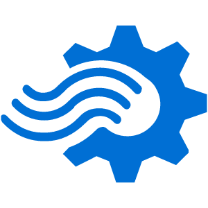

  
  
  
  
  
  
  
  
  
  
  
  
  
  
  
  
  
  
  
  
  
  
  
  
  
  
  
  
  
  
  
  
  
  
  
  
  
  
  
  
  
  
  
  
  
  
  

 

## Welcome Welcome Welcome! 🌟

🌟 Welcome to my GitHub space, where **data engineering** and **data analytics** come to life with the power of Azure! 🚀

This repository showcases a variety of projects that blend the technical expertise of **Azure Data Engineering** with the creativity of **Data Analytics**. 
Here, you'll find a collection of my work focused on:

🔹**Transforming raw data into insightful visualizations** using tools like **Power BI** and **Azure Synapse Analytics**.

🔹**Building robust data pipelines** leveraging **Azure Data Factory**, **Azure Databricks**, and **Azure Data Lake**.

🔹**Optimizing data processes** to ensure scalable, efficient, and reliable data workflows across cloud environments.

Whether you're passionate about **building scalable data solutions**, diving deep into **data analytics**, or exploring the capabilities of **Azure technologies**, this repository is your go-to space to explore and learn.

## Join Me in Exploring the World of Data! 📈

I invite you to browse through my projects, where I tackle real-world data problems, build end-to-end solutions, and continuously explore new ways to make data-driven decisions. The world of data is vast, and together we can uncover endless possibilities!

Let's make sense of the numbers, optimize processes, and dive into the powerful world of **Azure Data Engineering** and **Data Analytics**! 💻📊

Feel free to **fork**, **adapt**, or **contribute**. **Feedback** and **collaboration** are always welcome! 🤝

---

🚀 **Technologies Used**:
||||
|-----------------------------|-------------------------------|-------------------------------|
| Azure Data Factory (ADF)    | Azure Databricks              | Python                        |
| Azure Synapse Analytics     | Delta Lake                    | SQL                           |
| Azure Data Lake Storage     | Apache Spark (via Databricks) | Power BI, Tableau             |
| Azure Key Vault             | Medallion Architecture        | Pandas & Matplotlib           |
| Azure Monitor               | Unity Catalog                 | Visual Studio Code            |
| Azure Blob Storage          | Azure Stream Analytics        | SSMS, OnPrem                  |
| Azure SQL Database          | Azure Event Hubs              | Jupyter Notebook              |

---

### Let's Connect! 💬 
Feel free to **fork**, **adapt**, or **contribute** to any of these projects.  **Feedback and collaboration are always welcome!** 🙌
 

<!--  -->

<h2> 

 A Glimpse Into My Journey 

</h2>

<h3> 

   From Curious Beginnings to Data-Driven Solutions 

</h3>

 

My love for computers began when I was just 3 years old, thanks to my dad. The first toy I truly enjoyed was not a car or a ball but a computer. Roadrash was the first game I played, and I was instantly hooked. I was always curious about how computers worked, and every time my dad opened up the CPU to clean it, I had countless questions. With each answer, my fascination grew deeper, and I took another step toward my love for computers.

During my school days, I became the go-to person whenever someone needed help in the computer lab or wanted the latest PC games. I was both a computer enthusiast and an avid gamer, exploring legendary titles like Roadrash, Prince of Persia, NFS II SE, Most Wanted, Underground 2, V Cop 2, Recoil, GTA III, IGI, and Counter-Strike, all on my trusty Pentium 4 with 1 GB of RAM and 40 GB of storage. Those were golden days, and my passion for computers never faded.

As I grew older, my curiosity transformed into a desire to understand the intricate workings of computers. This interest led me to pursue computer engineering in my undergraduate studies, where I delved into database management systems, SQL, data mining, and the transformative impact of artificial intelligence. I became fascinated with how data can tell stories, waiting to be uncovered.

This passion took me further into postgraduate studies in data analytics, where I learned how data reveals trends, answers critical questions, and informs strategic decisions. I explored the powerful ways data can shape industries and solve complex problems.

Throughout my career, I’ve had the privilege of contributing to a wide range of industries—from wholesaling and manufacturing to marketing operations. In roles like Data Coordinator and Survey Analyst, I helped clean and transform data, creating visualizations and dashboards that brought clarity and actionable insights to decision-makers.

As a Data Analyst, I’ve always been drawn to what data has to say, but I don’t always understand its language. That’s why I rely on tools like SQL, Python, Power BI, Excel, and machine learning frameworks to decode the stories data hides.

Every dataset presents a new challenge that fuels my passion for learning. I thrive in collaborative environments where teamwork fosters creativity and problem-solving, and I’m committed to staying at the forefront of the latest trends and technologies in data analytics.

I’m excited to bring my analytical skills and passion for data-driven insights to a team dedicated to excellence. Let’s connect and explore how I can contribute to achieving your organization’s goals.

<!-- <h3 align="center"> :briefcase: Technology Stack </h3> -->

 

<h2 align="center"> :bar_chart: Stats </h2>

  
  ### Total Contribution
  

  ### 🔝 Top Contributed Repo
  

  ### :chart_with_upwards_trend: Contribution Graph
  

<!-- 

  

 -->

<!--  -->

<!--

-->

 

<!--

  
      

-->

<h3 align="center"> :email: Connect with Me </h3>

 

